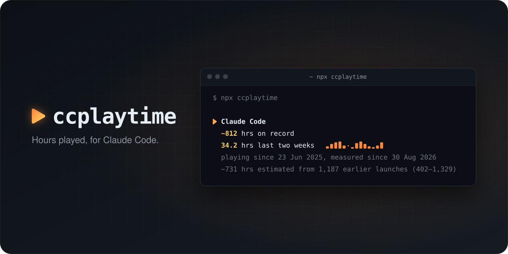

<p align="center">
  
</p>

# ccplaytime

Steam-style **hours played** for [Claude Code](https://code.claude.com).

```sh
npx ccplaytime
```

```
  ▶ Claude Code
    ~812 hrs on record
    34.2 hrs last two weeks  ▂▅▇█▃·▁▆█▅▂▁▃▇
    playing since 23 Jun 2025, measured since 30 Aug 2026
    ~731 hrs estimated from 1,187 earlier launches (402–1,329)
```

## How it counts

- **Every session, once.** Each transcript event, subagents included, lands on one timeline, so parallel sessions count as wall-clock time, not double.
- **Idle time is a break.** Gaps longer than 15 minutes (WakaTime's standard) don't count.
- **Your whole history.** Claude Code deletes transcripts after 30 days but keeps a lifetime count of terminal launches (resumes included; `-p`, IDE and desktop runs aren't counted). ccplaytime subtracts the sessions it can still measure and, once it has measured 10, estimates the remaining earlier launches between your typical (median) and average session, shown as their geometric midpoint with the range. Backtested on one heavy user's recent weeks, the midpoint landed within 26% of measured time, while the median alone ran up to 3× low and the average up to 2× high. Months-long spans, resumed sessions and launches that left no transcript add error, so estimates always carry a `~`.
- **Local only.** It reads `~/.claude/projects` and `~/.claude.json` and writes one small file, `~/.claude/ccplaytime.json`. Nothing leaves your machine. Set `CLAUDE_CONFIG_DIR` to use another directory.

## Keep your record

Your first run measures the last 30 days and estimates everything before. From then on, ccplaytime saves every (UTC) day it sees: run it at least every 30 days and the measured part keeps growing.

To never think about it, install it and let Claude Code run it after each session, in `~/.claude/settings.json`:

```sh
npm install --global ccplaytime
```

```json
{
  "hooks": {
    "SessionEnd": [
      { "hooks": [{ "type": "command", "command": "ccplaytime > /dev/null", "timeout": 60 }] }
    ]
  }
}
```

## For scripts

```sh
npx ccplaytime --json
```

```
{"hoursOnRecord":812.4,"hoursMeasured":81.3,"hoursEstimated":731.1,"hoursEstimatedRange":[402.1,1329.4],"hoursLastTwoWeeks":34.2,"playingSince":"2025-06-23","measuredSince":"2026-08-30","earlierLaunches":1187,"secondsByDay":{"2026-08-30":5506}}
```

## Develop

```sh
bun install      # also enables the pre-push hook
bun run check    # format, lint, typecheck, test, build
bun run verify   # check, plus the gate's own self-test (runs on git push)
```

## License

MIT
